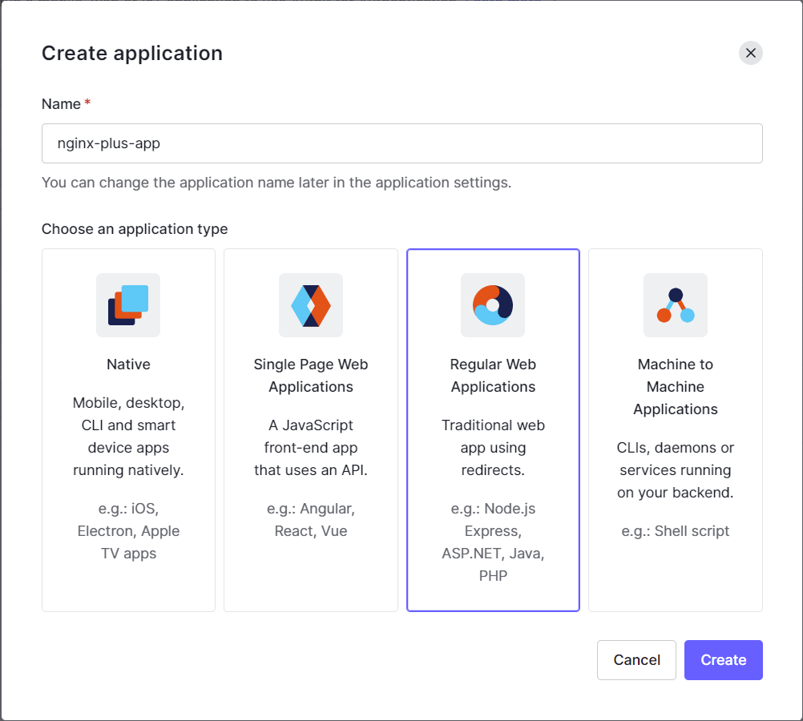
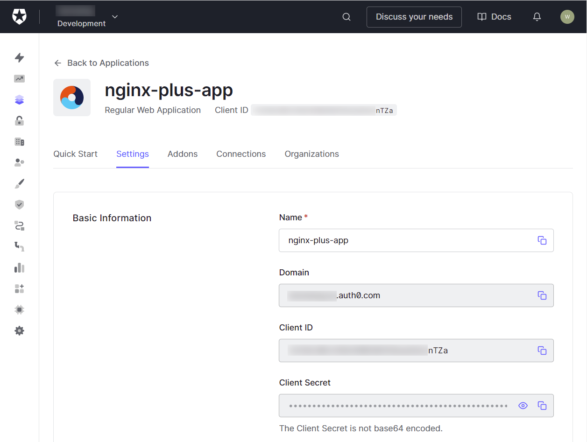
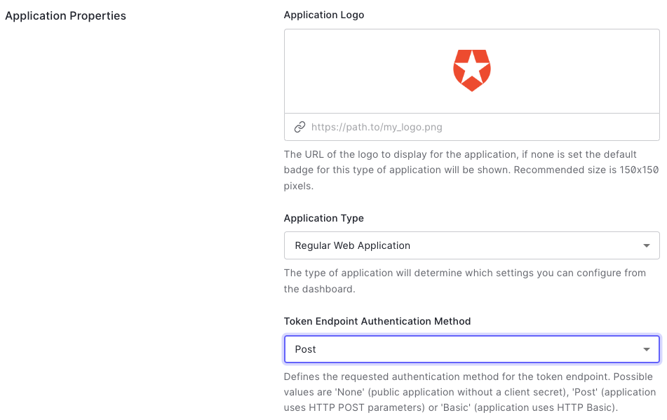
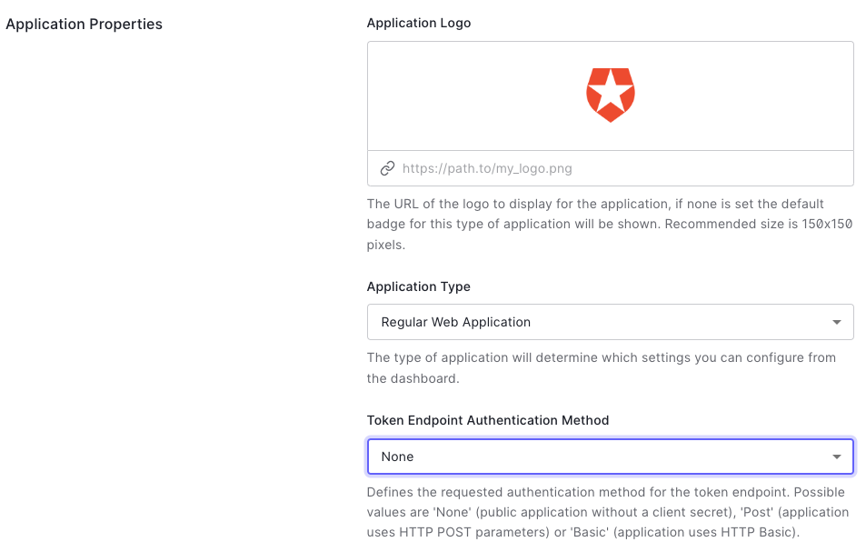
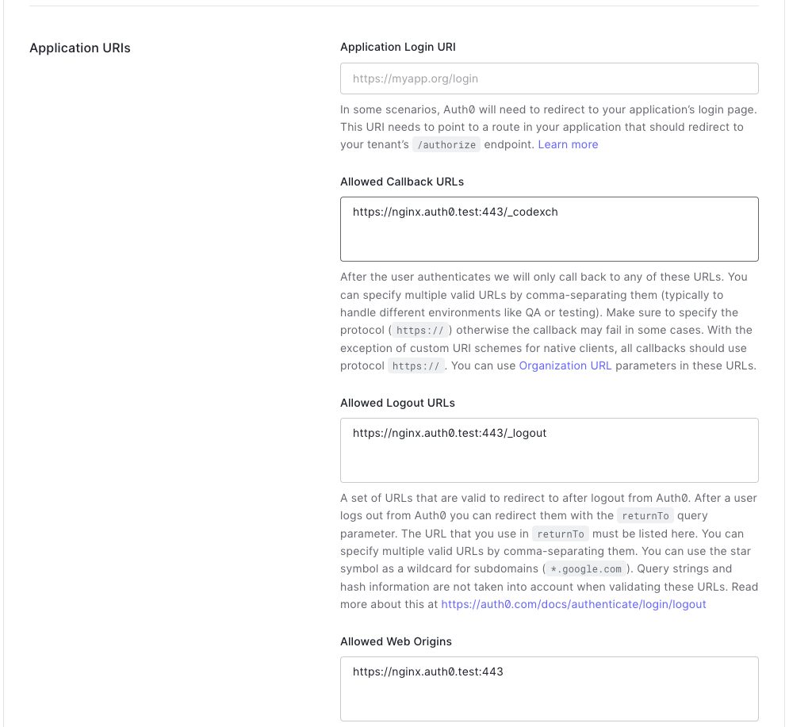
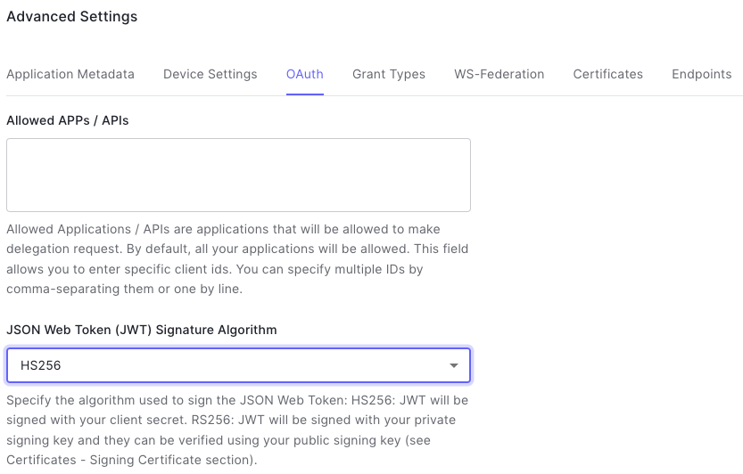
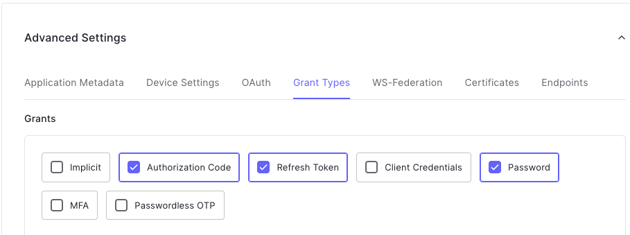
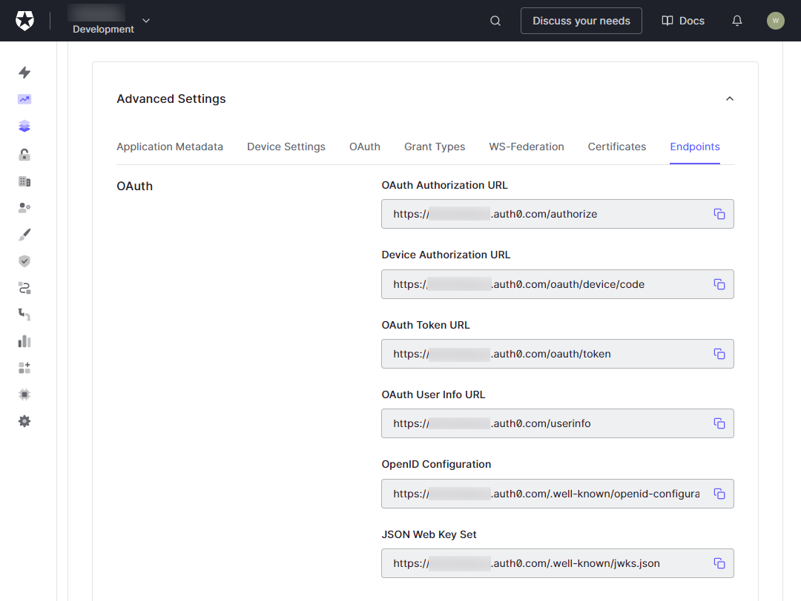
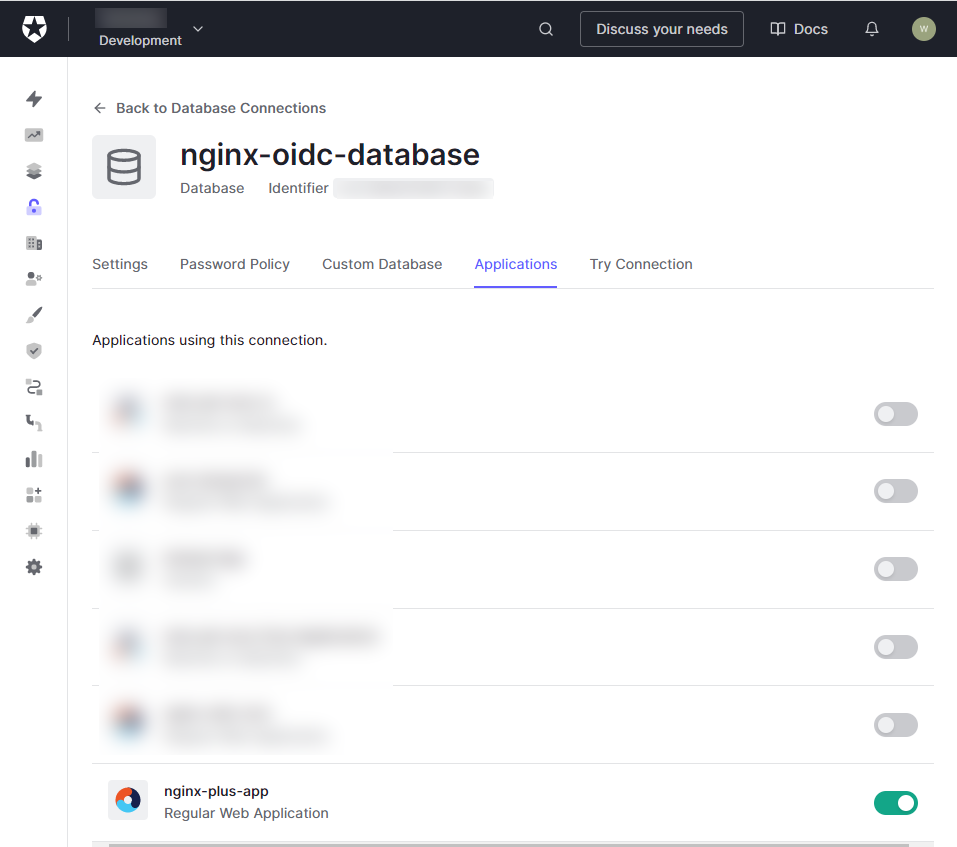

# How To Configure Auth0 for NGINX Plus OIDC Integration

Take the following steps to create a new application for NGINX Plus.

> **Note:**
>
> This section contains images that reflect the state of the Auth0 web interface at the time of publication. The actual Auth0 GUI may differ from the examples shown here. Use this guide as a reference and adapt the instructions to suit the current Auth0 GUI as necessary.

## Create a new Auth0 Application

1. Log in to your Auth0 Dashboard at [manage.auth0.com](https://manage.auth0.com/).

2. Select **Applications > Applications** from the sidebar menu.

3. On the **Applications** page, select the **Create Application** button.

4. In the **Create application** window, provide the information listed below and then select **Create**.
   - **Name**: A name for the application, for example “nginx-plus-app”.
   - **Application Type**: **Regular Web Applications**
     

## Set up the Web Application

In this section, you wll set up a web application that follows the [Auth0 Authorization Code Flow](https://auth0.com/docs/get-started/authentication-and-authorization-flow/authorization-code-flow).

1. On the **Application** page in the [Auth0 dashboard](https://manage.auth0.com/), select your web application.

2. Select the **Settings** tab for your application.

3. Make note of the Client ID and Client Secret displayed in the **Basic Information** section.
   

4. In the **Application Properties** section, choose one of options from the combo box in the **Token Endpoint Authentication Method** field.

   - Option 1. Choose **Post** if you don't enable **PKCE**.
     

   - Option 2. Choose **None** if you enable **PKCE**.
     

5. In the **Application URIs** section, provide the URI of the NGINX Plus instance in the fields of **Allowed Callback URLs** and **Allowed Logout URLs**.

   - **Allowed Callback URLs**: The URL must include the port number and end in **/\_codexch**. In our example, we used the URL `http://nginx.auth0.test:443/_codexch`.

   - **Allowed Logout URLs**: The URL must include the port number and end in **/\_codexch**. In our example, we used the URL `http://nginx.auth0.test:443/_logout`.

   > **Note:**
   >
   > - The port is always required, even if you use the default port for HTTP (80) or HTTPS (443).
   > - The use of SSL/TLS (443) is strongly recommended for production environments.
   > - You don't need to include the port number if it is either 80 or 443 if you use **NGINX-ACM > 1.1.1**.

   

6. In the **Advanced Settings** section, select the **OAuth** tab.

   - Option 1. Choose **RS256** if you don't enable **PKCE**.
     

   - Option 2. Choose **HS256** if you enable **PKCE**.
     

7. In the **Advanced Settings** section, select the **Grant Types** tab.

   - Option 1. Choose **Authorization Code, Refresn Token, Client Credentials, Password** if you don't enable **PKCE**.
     

   - Option 2. Choose **Authorization Code, Refresn Token, Password** if you enable **PKCE**.
     

8. In the **Advanced Settings** section, select the **Endpoints** tab.

9. Make note of the **OpenID Configuration** URL.
   

10. Select **Save Changes**.

## Set up Authentication

> **Note:**
> For the purposes of this guide, we will add a new Auth0 user database and user account to use for testing.
>
> You can set up authentication using any of the available [Auth0 identity providers](https://auth0.com/docs/authenticate/identity-providers).

To set up a new user database and add a user account to it, take the steps below.

1. Log in to the [Auth0 dashboard](https://manage.auth0.com/) and select **Authentication > Database** from the sidebar menu.

2. Select the **Create DB Connection** button.

3. Provide a **Name** for the database connection, then select **Create**.

4. On the **Database** page, select the **Applications** tab. Then, select the toggle button next to the [application you created earlier](#create-a-new-auth0-application).
   

5. In the sidebar menu, select **User Management > Users**.

6. On the **Users** page, select the **Create User** button.

7. In the **Create user** window, provide the following information, then select **Create**.

   - **Email**: user’s email
   - **Password**: a password for the user account
   - **Connection**: select your **database** from the list.

   

The user should receive an email to the email address provided. Once the user verifies their account by clicking on the link in the email, the account creation process is complete.
